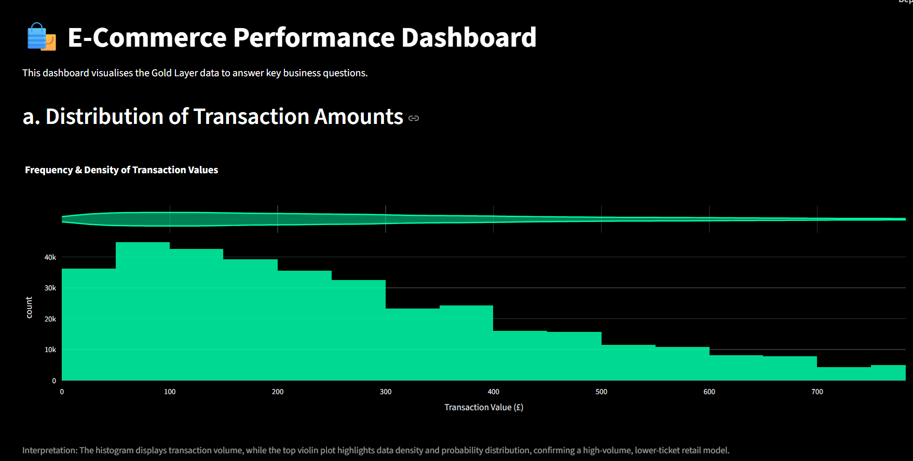
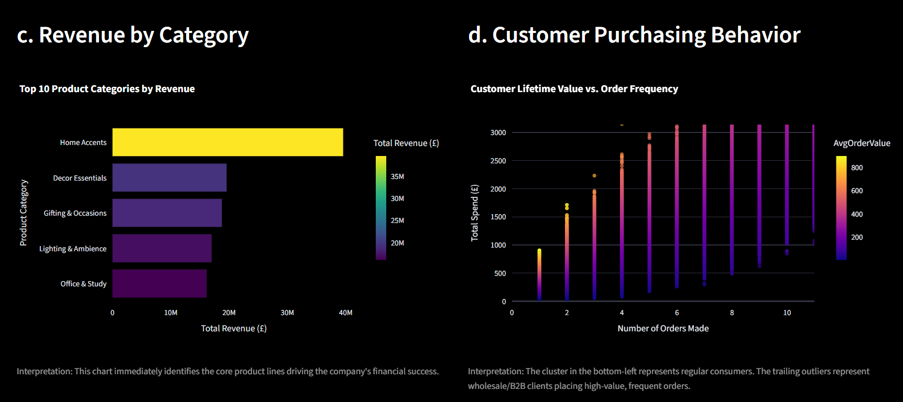

# E-Commerce Data Visualisation & Medallion Pipeline

## Problem Statement
The objective of this assessment task is to evaluate skills and expertise in data visualisation using a provided dataset of customer transactions for a UK-based e-commerce company. The dataset contains 500K rows and 9 columns, capturing sales data over one year. 

The task requires creating effective visualisations to answer four specific business questions:
* What is the distribution of transaction amounts?
* How does the total transaction amount vary over time?
* Which product categories generate the most revenue?
* Can you identify any trends or patterns in customer purchasing behaviour?

## My Approach
To ensure the dashboard is highly performant and scalable, I went beyond simply visualizing the raw CSV. I designed and implemented a **Medallion Data Architecture (Bronze -> Silver -> Gold)** integrated with **Databricks Unity Catalog**:
1. **Bronze Layer:** Raw data ingestion.
2. **Silver Layer:** Data cleaning and standardization. Calculated `TotalAmount` and filtered out cancelled orders (Transaction numbers starting with 'C').
3. **Gold Layer:** Pre-aggregated the data into 4 highly optimized summary tables explicitly designed to answer the assignment's business questions.
4. **Presentation Layer:** Built an interactive, dark-themed Streamlit web application that fetches the lightweight Gold tables and renders advanced Plotly charts.

## Tech Stack
* **Data Processing:** Python, Polars (chosen over Pandas for significantly faster, memory-efficient operations).
* **Data Storage / Backend:** Databricks (Unity Catalog Volumes).
* **API Integration:** `requests` (for cloud-to-local data fetching), `databricks-sdk`.
* **Frontend Dashboard:** Streamlit.
* **Visualisation:** Plotly (for professional-grade, interactive graphing).

## Tactics Used to Resolve the Queries
To effectively answer the specific questions, I utilized the following data transformation and visual encoding strategies:

1. **Distribution of Transaction Amounts:** 
   * *Data Tactic:* Grouped by `TransactionNo` to sum the total transaction value.
   * *Visual Tactic:* Used a **Histogram with a Marginal Violin Plot**. The histogram shows raw volume, while the violin plot reveals probability density, easily highlighting the high-volume, low-ticket nature of the business.
2. **Total Transaction Amount Over Time:**
   * *Data Tactic:* Grouped by `Date` and aggregated total daily revenue.
   * *Visual Tactic:* Used a **Time-Series Line Chart** to easily identify volatility, seasonal spikes, and baseline revenue trends over the course of the year.
3. **Product Categories by Revenue:**
   * *Data Tactic:* Grouped by `Category`, summed total revenue, and sorted descending.
   * *Visual Tactic:* Used a **Horizontal Bar Chart** with a heat-mapped color scale. This creates an immediate visual hierarchy, isolating the top-performing categories at a glance.
4. **Trends in Customer Purchasing Behaviour:**
   * *Data Tactic:* Grouped by `CustomerNo` to calculate lifetime spend, total number of orders, and average order value.
   * *Visual Tactic:* Used a **Scatter Plot** mapped with a continuous color scale. This successfully segmented standard retail consumers (dense bottom-left cluster) from high-value B2B/wholesale clients (trailing outliers).

## Results / Screenshots

**1. Transaction Distribution**


**2. Revenue Over Time**


**3. Category Revenue & Purchasing_behavior**


## Instructions: How to Run This Project
To replicate this project on your local machine, follow these steps:

1. **Clone the Repository:**
   ```bash
   git clone [YOUR_GITHUB_REPO_LINK]
   cd E-commerce_Transactions_Medallion_Pipeline


About Me
Hi, I'm Shubham Tyagi, a Data Engineer/Analyst passionate about building robust data pipelines and transforming complex datasets into actionable business insights.

LinkedIn: [https://www.linkedin.com/in/shubhamtyagi16/]

GitHub: []

Email: [shubhamvatstyagi7@gmail.com]